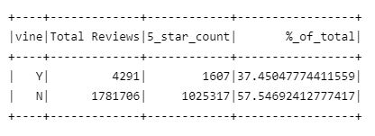

# Amazon Vine Analysis

This report is analyzing Amazon review written by members of the paid Amazon Vine program. Amazon provides dataset for multiple shopping categories, but due to volume of data, the analysis will focus on Videos Games only.

## Results 

### How many reviews and non-Vine reviews where there? 

Within the Video Game dataset:
- there were 4291 paid reviews 
- and 1781706 non-paid reviews.

### How many Vine paid/non-paid review were 5 stars? 
Within the Video Game dataset: 
- there were 1607 paid 5 star reviews
- and 1025317 non-paid 5 star reviews. 

### What percentage where the 5 star reviews in their respective categories? 
- Of the paid reviews, 5 star reviews represented about 38% of the total 
- Of the non-paid reviews, 5 star revies represented about 58% of the total

## Summary 

After aggregating and calculating the percent of 5 star reviews in each category, there does not seem to be a bias in the Vine program. 5 star paid reviews represented a significantly lower percentage when compared to the non-paid reviews. 

However this is a top level view and requires further analysis. For next steps, I would suggest to break down the further by:
- further aggregating by whether or not a purchases is verified, 
- and count whether or not a customer_id is writing multiple 5 star reviews. 

